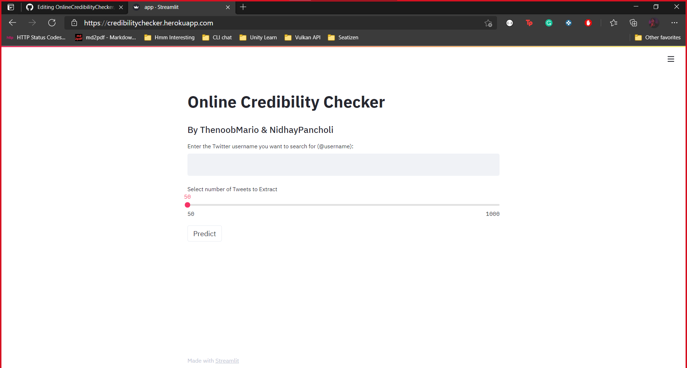

# Online Credibility Checker
As an Interviewer, wouldn’t you love to know how the person you’re interviewing would behave in the workplace?

Because:
1. The interview is the one place where they would be their **best self**.

2. As a company with professional employees, its better to perform a background check of the _"to-be"_ employees.

3. As a Sales representative, you have to choose an influencer which is **best suited** to promote your product.

4. Also the member of the HR Team should know if the person is prone to writing something triggering, which would *jeopardize* their position or the company.

This is where the **Online Credibility Checker** comes in.

## Solution
Use this tool to check the [Online Persona](https://www.merriam-webster.com/dictionary/persona) of a potential employee.

- The credibility checker uses (for now) the **tweets**  of the person to identify their most common hashtags, emojis and words used.

- It also uses a clustering algorithm to classify the tweets into 10 different groups and then using these predictions, a *probable* judgment about the person's Online Persona is made. The clustering is **unsupervised** which opens the possibility for the model to learn by itself.

- Greater insights are also given in the form of correlative plots between the average number of likes and retweets vs. the respective clusters.

## Dataset
[TweetSentiments](https://www.kaggle.com/eklavyas/tweetsentiments)

## Tech Stack
1. **Tweepy:** Used to authenticate the Twitter API and read data using it.

2. **SciKit-Learn:** The Machine Learning library used for clustering.

3. **Natural Language Toolkit:** The toolkit used for parsing and cleaning tweets.

4. **Streamlit:** Used to Build and Share the data app.

## Video
You can check the video out [**here**](https://drive.google.com/file/d/1ZtT5u9hNkfAD9ff7JyhMOsBU8_bniE-3/view?usp=sharing).

## Creators
1. [Nachiket Soni](https://drive.google.com/file/d/1sa0eneGdQIHT5otRii-sYNLVCIU9DtAR/view?usp=sharing)
    - Github - [@ThenoobMario](https://github.com/ThenoobMario)
    - LinkedIn - [Nachiket Soni](https://www.linkedin.com/in/nachiket-soni-9519021aa/)
2. [Nidhay Pancholi](https://drive.google.com/file/d/1Lxwa8WbPDuu7QgE7oMsObRBUTUZf85ob/view)
    - Github - [@NidhayPancholi](https://github.com/NidhayPancholi)
    - LinkedIn - [Nidhay Pancholi](https://www.linkedin.com/in/nidhay-pancholi-740a701a5/)

## What's next?
*Trying out better clustering algorithms to refine the Machine Learning Process.

*Including more social media platforms such as LinkedIn, Instagram etc. for better judgement.
